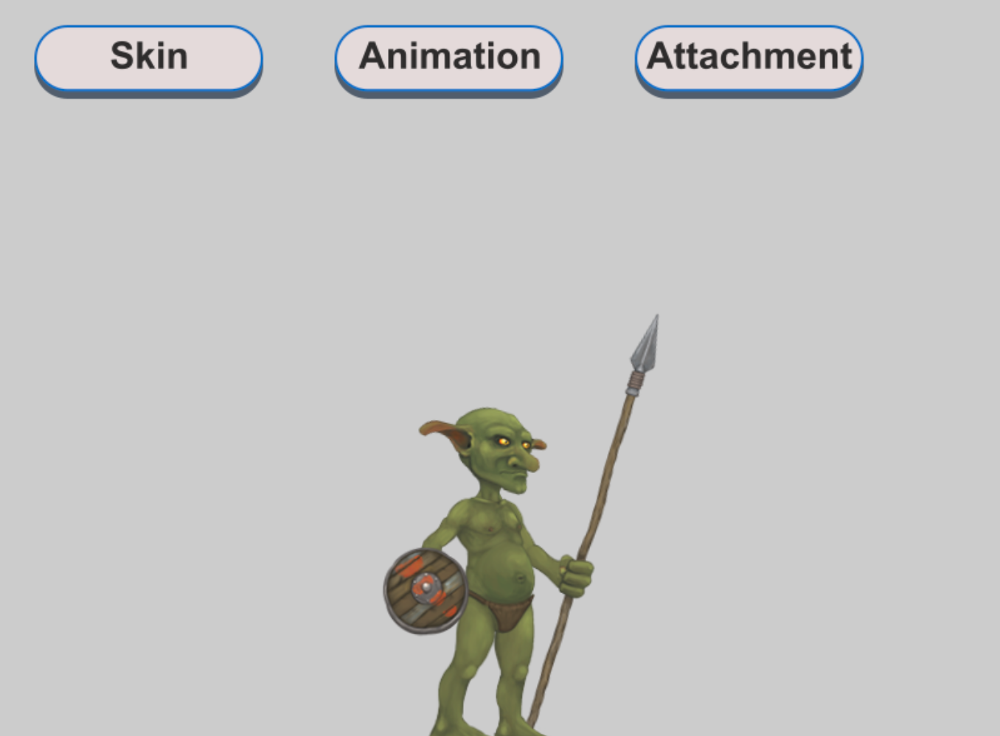

<h1 align="center">
   
  Phaser 3 Spine Example
   
</h1>

  
  
  

Using Phaser v3.21.0 and Spine v3.8.78

- Change Skins
- Change Animations
- Change Attachments

[Play the demo](https://s3.eu-central-1.amazonaws.com/phaser3-typescript/spine-example/index.html)

## Questions?

Take a look at the [topic #1042](https://phaser.discourse.group/t/1042) in the Phaser forum.

## Phaser Starter Template

Looking for a powerful Phaser Starter Template?

Try [phaser-project-template](https://github.com/yandeu/phaser-project-template) or [phaser-project-template-es6](https://github.com/yandeu/phaser-project-template-es6)
